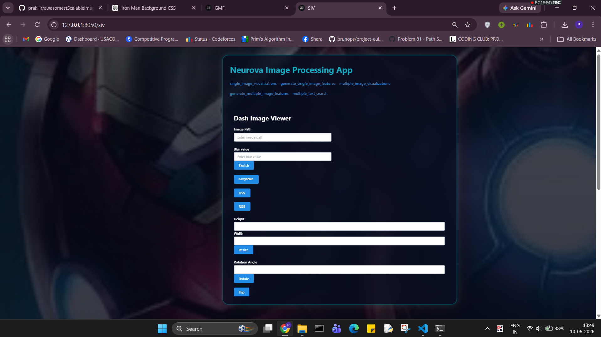
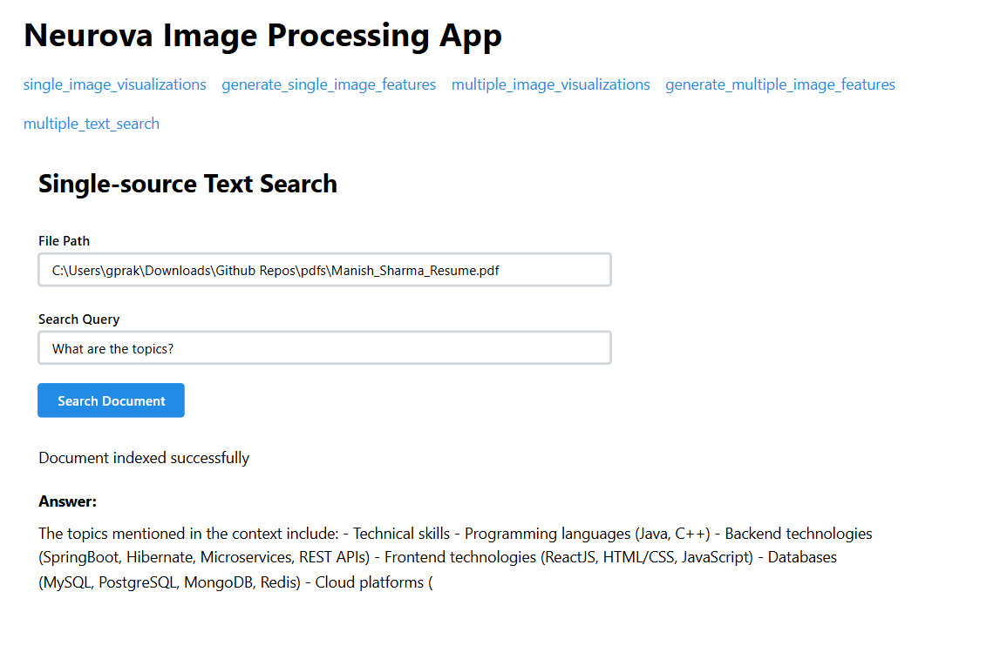
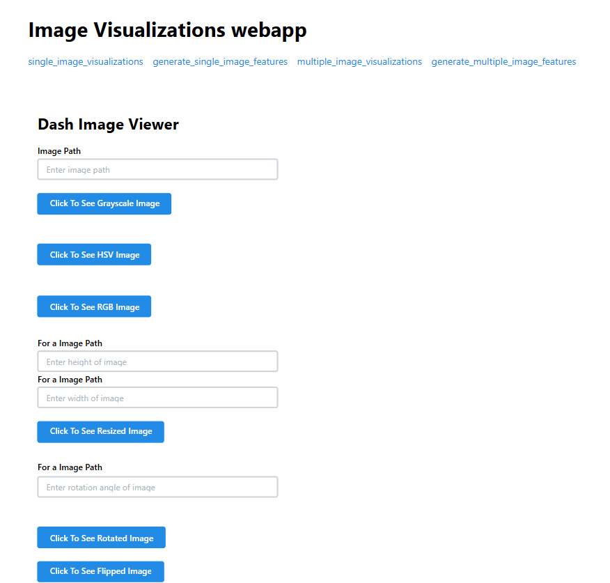
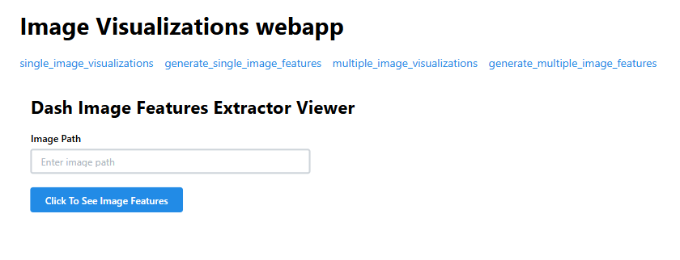
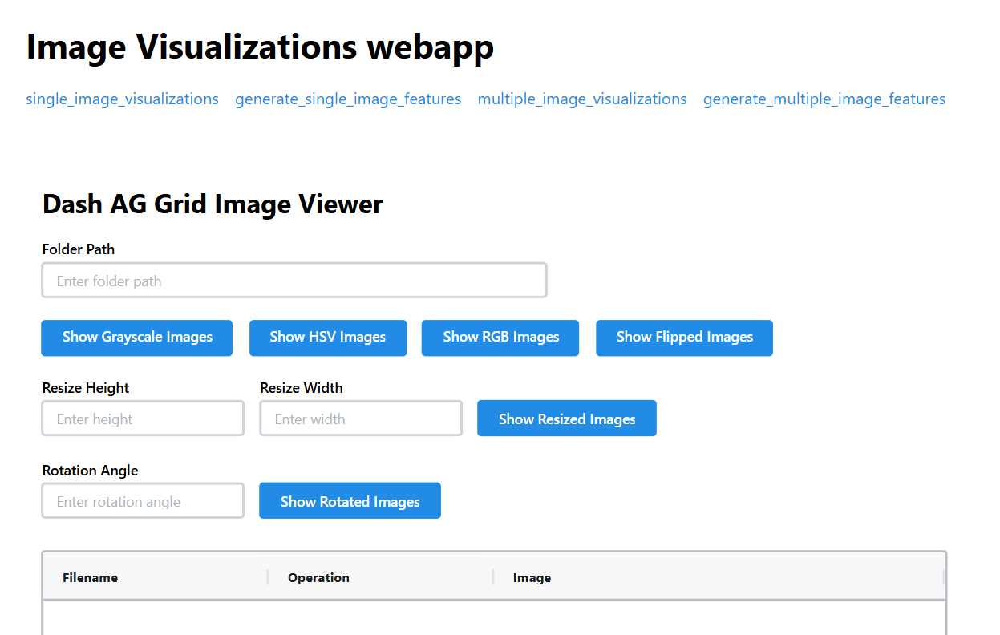
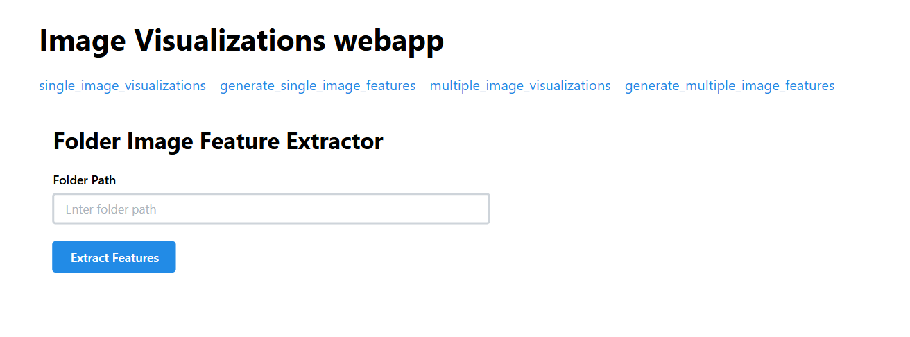
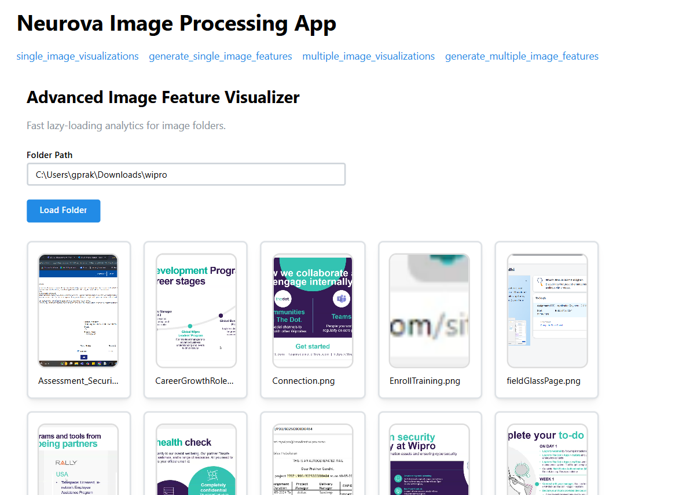

# Special Screen

# Special Screen - Single Source Text Search

# Screen 2 - Single Image Visualizations

# Screen 3 - Generate Single Image Features

# Screen 4 - Multiple Image Visualizations

# Screen 5 - Generate Multiple Image Features

# imageFeaturesVisualization
contains most awesome scalable visualizations for image features
